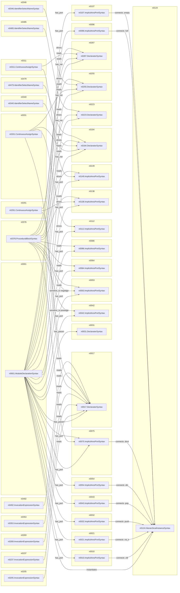

# Semantic graph — fifo.sv + top.sv

Nodes: 39, edges: 61.

```mermaid
flowchart LR
  subgraph n0001["n0001"]
    n0001_ModuleDeclarationSyntax["n0001.ModuleDeclarationSyntax"]
    n0001_ModuleDeclarationSyntax["n0001.ModuleDeclarationSyntax"]
  end
  subgraph n0017["n0017"]
    n0017_DeclaratorSyntax["n0017.DeclaratorSyntax"]
    n0017_DeclaratorSyntax["n0017.DeclaratorSyntax"]
  end
  subgraph n0031["n0031"]
    n0031_DeclaratorSyntax["n0031.DeclaratorSyntax"]
  end
  subgraph n0042["n0042"]
    n0042_ImplicitAnsiPortSyntax["n0042.ImplicitAnsiPortSyntax"]
  end
  subgraph n0053["n0053"]
    n0053_ImplicitAnsiPortSyntax["n0053.ImplicitAnsiPortSyntax"]
  end
  subgraph n0064["n0064"]
    n0064_ImplicitAnsiPortSyntax["n0064.ImplicitAnsiPortSyntax"]
  end
  subgraph n0075["n0075"]
    n0075_ImplicitAnsiPortSyntax["n0075.ImplicitAnsiPortSyntax"]
    n0075_ImplicitAnsiPortSyntax["n0075.ImplicitAnsiPortSyntax"]
  end
  subgraph n0086["n0086"]
    n0086_ImplicitAnsiPortSyntax["n0086.ImplicitAnsiPortSyntax"]
  end
  subgraph n0112["n0112"]
    n0112_ImplicitAnsiPortSyntax["n0112.ImplicitAnsiPortSyntax"]
  end
  subgraph n0138["n0138"]
    n0138_ImplicitAnsiPortSyntax["n0138.ImplicitAnsiPortSyntax"]
  end
  subgraph n0149["n0149"]
    n0149_ImplicitAnsiPortSyntax["n0149.ImplicitAnsiPortSyntax"]
  end
  subgraph n0184["n0184"]
    n0184_DeclaratorSyntax["n0184.DeclaratorSyntax"]
  end
  subgraph n0205["n0205"]
    n0205_InvocationExpressionSyntax["n0205.InvocationExpressionSyntax"]
  end
  subgraph n0223["n0223"]
    n0223_DeclaratorSyntax["n0223.DeclaratorSyntax"]
  end
  subgraph n0237["n0237"]
    n0237_InvocationExpressionSyntax["n0237.InvocationExpressionSyntax"]
  end
  subgraph n0255["n0255"]
    n0255_DeclaratorSyntax["n0255.DeclaratorSyntax"]
  end
  subgraph n0269["n0269"]
    n0269_InvocationExpressionSyntax["n0269.InvocationExpressionSyntax"]
  end
  subgraph n0287["n0287"]
    n0287_DeclaratorSyntax["n0287.DeclaratorSyntax"]
  end
  subgraph n0291["n0291"]
    n0291_ContinuousAssignSyntax["n0291.ContinuousAssignSyntax"]
  end
  subgraph n0311["n0311"]
    n0311_ContinuousAssignSyntax["n0311.ContinuousAssignSyntax"]
  end
  subgraph n0331["n0331"]
    n0331_ContinuousAssignSyntax["n0331.ContinuousAssignSyntax"]
  end
  subgraph n0340["n0340"]
    n0340_IdentifierSelectNameSyntax["n0340.IdentifierSelectNameSyntax"]
  end
  subgraph n0346["n0346"]
    n0346_IdentifierSelectNameSyntax["n0346.IdentifierSelectNameSyntax"]
  end
  subgraph n0353["n0353"]
    n0353_InvocationExpressionSyntax["n0353.InvocationExpressionSyntax"]
  end
  subgraph n0376["n0376"]
    n0376_ProceduralBlockSyntax["n0376.ProceduralBlockSyntax"]
  end
  subgraph n0479["n0479"]
    n0479_IdentifierSelectNameSyntax["n0479.IdentifierSelectNameSyntax"]
  end
  subgraph n0485["n0485"]
    n0485_IdentifierSelectNameSyntax["n0485.IdentifierSelectNameSyntax"]
  end
  subgraph n0492["n0492"]
    n0492_InvocationExpressionSyntax["n0492.InvocationExpressionSyntax"]
  end
  subgraph n0010["n0010"]
    n0010_ImplicitAnsiPortSyntax["n0010.ImplicitAnsiPortSyntax"]
  end
  subgraph n0021["n0021"]
    n0021_ImplicitAnsiPortSyntax["n0021.ImplicitAnsiPortSyntax"]
  end
  subgraph n0032["n0032"]
    n0032_ImplicitAnsiPortSyntax["n0032.ImplicitAnsiPortSyntax"]
  end
  subgraph n0043["n0043"]
    n0043_ImplicitAnsiPortSyntax["n0043.ImplicitAnsiPortSyntax"]
  end
  subgraph n0054["n0054"]
    n0054_ImplicitAnsiPortSyntax["n0054.ImplicitAnsiPortSyntax"]
  end
  subgraph n0096["n0096"]
    n0096_ImplicitAnsiPortSyntax["n0096.ImplicitAnsiPortSyntax"]
  end
  subgraph n0107["n0107"]
    n0107_ImplicitAnsiPortSyntax["n0107.ImplicitAnsiPortSyntax"]
  end
  subgraph n0124["n0124"]
    n0124_HierarchicalInstanceSyntax["n0124.HierarchicalInstanceSyntax"]
  end
  n0001_ModuleDeclarationSyntax -- "has_param" --> n0017_DeclaratorSyntax
  n0001_ModuleDeclarationSyntax -- "has_param" --> n0031_DeclaratorSyntax
  n0001_ModuleDeclarationSyntax -- "has_port" --> n0042_ImplicitAnsiPortSyntax
  n0001_ModuleDeclarationSyntax -- "has_port" --> n0053_ImplicitAnsiPortSyntax
  n0001_ModuleDeclarationSyntax -- "has_port" --> n0064_ImplicitAnsiPortSyntax
  n0001_ModuleDeclarationSyntax -- "has_port" --> n0075_ImplicitAnsiPortSyntax
  n0001_ModuleDeclarationSyntax -- "has_port" --> n0086_ImplicitAnsiPortSyntax
  n0001_ModuleDeclarationSyntax -- "has_port" --> n0112_ImplicitAnsiPortSyntax
  n0001_ModuleDeclarationSyntax -- "has_port" --> n0138_ImplicitAnsiPortSyntax
  n0001_ModuleDeclarationSyntax -- "has_port" --> n0149_ImplicitAnsiPortSyntax
  n0001_ModuleDeclarationSyntax -- "has_net" --> n0184_DeclaratorSyntax
  n0001_ModuleDeclarationSyntax -- "has_net" --> n0223_DeclaratorSyntax
  n0001_ModuleDeclarationSyntax -- "has_net" --> n0255_DeclaratorSyntax
  n0001_ModuleDeclarationSyntax -- "has_net" --> n0287_DeclaratorSyntax
  n0205_InvocationExpressionSyntax -- "reads" --> n0017_DeclaratorSyntax
  n0237_InvocationExpressionSyntax -- "reads" --> n0017_DeclaratorSyntax
  n0269_InvocationExpressionSyntax -- "reads" --> n0017_DeclaratorSyntax
  n0291_ContinuousAssignSyntax -- "drives" --> n0138_ImplicitAnsiPortSyntax
  n0291_ContinuousAssignSyntax -- "reads" --> n0287_DeclaratorSyntax
  n0291_ContinuousAssignSyntax -- "reads" --> n0017_DeclaratorSyntax
  n0311_ContinuousAssignSyntax -- "drives" --> n0149_ImplicitAnsiPortSyntax
  n0311_ContinuousAssignSyntax -- "reads" --> n0287_DeclaratorSyntax
  n0331_ContinuousAssignSyntax -- "drives" --> n0112_ImplicitAnsiPortSyntax
  n0331_ContinuousAssignSyntax -- "reads" --> n0184_DeclaratorSyntax
  n0331_ContinuousAssignSyntax -- "reads" --> n0255_DeclaratorSyntax
  n0331_ContinuousAssignSyntax -- "reads" --> n0017_DeclaratorSyntax
  n0340_IdentifierSelectNameSyntax -- "reads" --> n0184_DeclaratorSyntax
  n0346_IdentifierSelectNameSyntax -- "reads" --> n0255_DeclaratorSyntax
  n0353_InvocationExpressionSyntax -- "reads" --> n0017_DeclaratorSyntax
  n0376_ProceduralBlockSyntax -- "sensitive_to posedge" --> n0042_ImplicitAnsiPortSyntax
  n0376_ProceduralBlockSyntax -- "sensitive_to negedge" --> n0053_ImplicitAnsiPortSyntax
  n0376_ProceduralBlockSyntax -- "drives" --> n0223_DeclaratorSyntax
  n0376_ProceduralBlockSyntax -- "drives" --> n0255_DeclaratorSyntax
  n0376_ProceduralBlockSyntax -- "drives" --> n0287_DeclaratorSyntax
  n0376_ProceduralBlockSyntax -- "drives" --> n0184_DeclaratorSyntax
  n0376_ProceduralBlockSyntax -- "reads" --> n0086_ImplicitAnsiPortSyntax
  n0376_ProceduralBlockSyntax -- "reads" --> n0053_ImplicitAnsiPortSyntax
  n0376_ProceduralBlockSyntax -- "reads" --> n0064_ImplicitAnsiPortSyntax
  n0376_ProceduralBlockSyntax -- "reads" --> n0138_ImplicitAnsiPortSyntax
  n0376_ProceduralBlockSyntax -- "reads" --> n0075_ImplicitAnsiPortSyntax
  n0376_ProceduralBlockSyntax -- "reads" --> n0149_ImplicitAnsiPortSyntax
  n0479_IdentifierSelectNameSyntax -- "reads" --> n0184_DeclaratorSyntax
  n0485_IdentifierSelectNameSyntax -- "reads" --> n0223_DeclaratorSyntax
  n0492_InvocationExpressionSyntax -- "reads" --> n0017_DeclaratorSyntax
  n0001_ModuleDeclarationSyntax -- "has_port" --> n0010_ImplicitAnsiPortSyntax
  n0001_ModuleDeclarationSyntax -- "has_port" --> n0021_ImplicitAnsiPortSyntax
  n0001_ModuleDeclarationSyntax -- "has_port" --> n0032_ImplicitAnsiPortSyntax
  n0001_ModuleDeclarationSyntax -- "has_port" --> n0043_ImplicitAnsiPortSyntax
  n0001_ModuleDeclarationSyntax -- "has_port" --> n0054_ImplicitAnsiPortSyntax
  n0001_ModuleDeclarationSyntax -- "has_port" --> n0075_ImplicitAnsiPortSyntax
  n0001_ModuleDeclarationSyntax -- "has_port" --> n0096_ImplicitAnsiPortSyntax
  n0001_ModuleDeclarationSyntax -- "has_port" --> n0107_ImplicitAnsiPortSyntax
  n0001_ModuleDeclarationSyntax -- "instantiates" --> n0124_HierarchicalInstanceSyntax
  n0010_ImplicitAnsiPortSyntax -- "connects .clk" --> n0124_HierarchicalInstanceSyntax
  n0021_ImplicitAnsiPortSyntax -- "connects .rst_n" --> n0124_HierarchicalInstanceSyntax
  n0032_ImplicitAnsiPortSyntax -- "connects .push" --> n0124_HierarchicalInstanceSyntax
  n0043_ImplicitAnsiPortSyntax -- "connects .pop" --> n0124_HierarchicalInstanceSyntax
  n0054_ImplicitAnsiPortSyntax -- "connects .din" --> n0124_HierarchicalInstanceSyntax
  n0075_ImplicitAnsiPortSyntax -- "connects .dout" --> n0124_HierarchicalInstanceSyntax
  n0096_ImplicitAnsiPortSyntax -- "connects .full" --> n0124_HierarchicalInstanceSyntax
  n0107_ImplicitAnsiPortSyntax -- "connects .empty" --> n0124_HierarchicalInstanceSyntax
```
